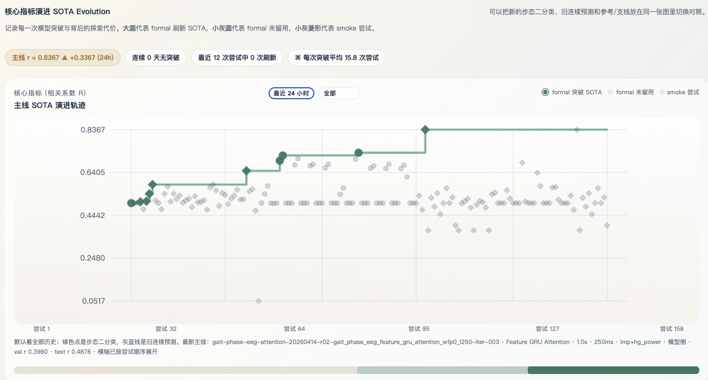

# AutoBCI

**AI Agent system for autonomous scientific research.**
<<<<<<< Updated upstream

Director thinks. Executor runs. Built for brain-computer interface, generalizable to any experimental research.

---

## What is this

AutoBCI is a research automation framework where two AI Agents collaborate to run scientific experiments autonomously:

- **Director** analyzes previous results, diagnoses why progress stalled, and decides the next research direction
- **Executor** sets up environments, modifies code, runs experiments, and writes back structured results
- They communicate through files — naturally persistent, observable, and crash-recoverable

The system can run overnight without human intervention. When one direction hits a dead end, Director switches to a new approach automatically.

## Recent result

On a gait-phase EEG binary classification task, Director detected that plain models were stuck near chance level (57.7%), autonomously switched to an attention-based approach, and Executor pushed accuracy to **73.7%** overnight — a 16-point improvement with zero human intervention.

## Architecture

```
Director (thinks)
  reads experiment results
  diagnoses bottleneck
  decides next direction
  writes new program + tracks
      ↓  file handoff
Executor (acts)
  reads instructions
  configures environment
  runs experiments
  writes results
      ↓
Director analyzes again...
=======
**让 AI Agent 自主进行科学研究的系统。**

Director thinks. Executor runs. Built for brain-computer interface, generalizable to any experimental research.



---

## What is this / 这是什么

AutoBCI is a research automation framework where two AI Agents collaborate to run scientific experiments autonomously:

- **Director** analyzes previous results, diagnoses why progress stalled, and decides the next research direction
- **Executor** sets up environments, modifies code, runs experiments, and writes back structured results
- They communicate through files — naturally persistent, observable, and crash-recoverable

The system runs overnight without human intervention. When one direction hits a dead end, Director switches to a new approach automatically.

AutoBCI 是一个研究自动化框架，由两个 AI Agent 协作完成科学实验：

- **Director** 分析上一轮结果、诊断瓶颈、决定下一步方向
- **Executor** 配环境、改代码、跑实验、写回结果
- 通过文件系统通信——天然持久、可观测、崩溃可恢复

系统可以整夜无人值守运行。一条方向走不通时，Director 自动换方向继续。

---

## Recent result / 最近成果

On a gait-phase EEG binary classification task, Director detected that plain models were stuck near chance level (57.7%), autonomously switched to an attention-based approach, and Executor pushed accuracy to **73.7%** overnight — a 16-point improvement with zero human intervention.

在步态脑电二分类任务上，Director 发现 plain 模型全部接近随机水平（57.7%），自动切换到 attention 机制，Executor 一夜之间把准确率拉到 **73.7%**——提升 16 个百分点，全程无人工干预。

---

## Architecture / 架构

```
Director（想）
  读取上一轮实验结果
  诊断为什么卡住了
  决定下一步方向
  写出新的 program + tracks
      ↓  文件交接
Executor（做）
  读取指令
  配环境、改代码
  跑实验
  写回结果
      ↓
Director 再次分析...
>>>>>>> Stashed changes
```

Communication is file-based by design:
- Experiments take minutes to hours — communication latency doesn't matter
- Files are naturally persistent — crash and restart from where you left off
- Files are naturally observable — every decision is in JSONL logs

<<<<<<< Updated upstream
## Framework benchmark

We measure the framework itself, not just model accuracy:

| Metric | Value |
|--------|-------|
| Total iterations | 800+ |
| Breakthrough rate | 1.3% |
| Cost per breakthrough | 78.7 iterations |
| Direction diversity | 0.74 (12 algorithm families) |
| Direction switches | 161 |
| Throughput | 4.7 iter/hour |

## Project structure
=======
通信方式选了文件而不是 API 或消息队列：
- 实验本身要跑几分钟到几小时，通信延迟不是瓶颈
- 文件天然持久——进程挂了重启就能从断点继续
- 文件天然可观测——所有决策历史都在 JSONL 日志里

---

## Framework benchmark / 框架基准

We measure the framework itself, not just model accuracy.
我们衡量的是框架本身的效率，不只是模型精度。

| Metric / 指标 | Value / 值 |
|--------|-------|
| Total iterations / 总迭代 | 800+ |
| Breakthrough rate / 突破率 | 1.3% |
| Cost per breakthrough / 每次突破成本 | 78.7 iterations |
| Direction diversity / 方向多样性 | 0.74 (12 algorithm families) |
| Direction switches / 方向切换 | 161 |
| Throughput / 吞吐量 | 4.7 iter/hour |

---

## Project structure / 项目结构
>>>>>>> Stashed changes

```
src/bci_autoresearch/
  control_plane/
<<<<<<< Updated upstream
    director.py          # Director agent core
    commands.py          # Supervisor, campaign launch, mission control
    cli.py               # CLI: autobci-agent
    paths.py             # Path definitions
    thinking.py          # Decision packets, evidence, judgment
    runtime_store.py     # JSONL/JSON read-write utilities

scripts/
  serve_dashboard.py     # Dashboard backend (localhost:8878)
  benchmark_framework_scheduling.py  # Framework efficiency benchmark

dashboard/
  index.html             # Single-page monitoring dashboard

tools/autoresearch/
  src/                   # Codex SDK campaign runner (TypeScript)
  program.md             # Current research program (task contract)
  tracks.current.json    # Current track manifest

docs/
  CONSTITUTION.md        # Immutable engineering constraints
```

## Quick start

```bash
# Install
pip install -e .

# Start dashboard
python scripts/serve_dashboard.py --port 8878

# Run Director analysis
autobci-agent direct

# Start supervised research loop
autobci-agent supervise --director-enabled --foreground
```

## Context

This project grew out of hands-on brain-computer interface work — craniotomy, electrode implantation, EEG acquisition, motion capture, and dataset creation for the China BCI Competition. The core insight: EEG signals are lossy observations of a perpetually drifting biological system. No static end-to-end model can capture the entire chain. We need dynamic systems that continuously adapt — and that's what AutoBCI is.

## License

=======
    director.py          # Director agent core / Director 核心
    commands.py          # Supervisor, campaign launch / 任务管理
    cli.py               # CLI: autobci-agent
    paths.py             # Path definitions / 路径定义
    thinking.py          # Decision packets, evidence / 决策与证据

scripts/
  serve_dashboard.py     # Dashboard backend / 面板后端
  benchmark_framework_scheduling.py  # Framework benchmark / 框架基准

dashboard/
  index.html             # Monitoring dashboard / 监控面板

tools/autoresearch/
  src/                   # Codex SDK campaign runner (TypeScript)
  program.md             # Research program (task contract) / 任务合同
  tracks.current.json    # Track manifest / 实验清单
```

---

## Quick start / 快速开始

```bash
# Install / 安装
pip install -e .

# Start dashboard / 启动面板
python scripts/serve_dashboard.py --port 8878

# Run Director analysis / 运行 Director 分析
autobci-agent direct

# Start supervised research loop / 启动自动研究循环
autobci-agent supervise --director-enabled --foreground
```

---

## Context / 背景

This project grew out of hands-on brain-computer interface work — craniotomy, electrode implantation, EEG acquisition, motion capture, and dataset creation for the China BCI Competition. The core insight: EEG signals are lossy observations of a perpetually drifting biological system. No static end-to-end model can capture the entire chain. We need dynamic systems to counter dynamic reality.

这个项目源于一线的脑机接口工作——开颅手术、电极植入、脑电采集、运动捕捉，以及为中国脑机接口大赛制作数据集。核心认知：脑电信号是对一个永恒漂移的生物系统的有损观测。不可能靠一个静态的端到端模型把整条链路囊括下来。我们只能以动态去制衡动态。

---

## License

>>>>>>> Stashed changes
Apache 2.0
