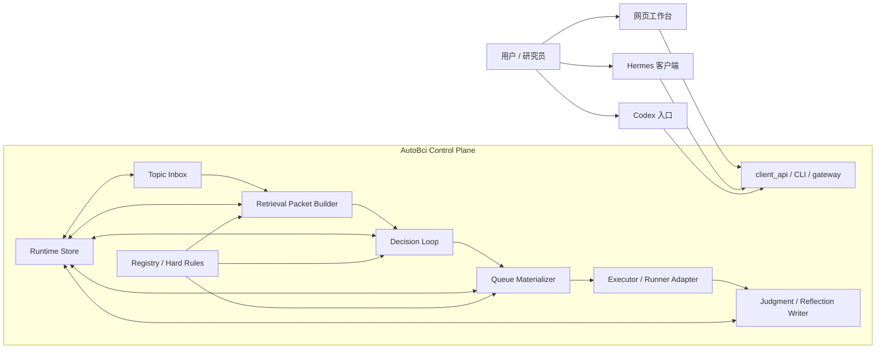

# AutoBci Agent 思考能力内置化 Spec

日期：2026-04-12  
状态：提案已定稿，作为后续实现的 canonical 技术规格  
适用范围：`/Users/mac/Code/AutoBci` 内置控制面、AutoResearch 执行层、网页工作台、Hermes/Codex 客户端

---

## 1. 一句话定义

这次不是给 AutoBci 再套一个“更会聊天的代理”，而是把它升级成一个**可审计的研究决策系统**：

- 会把新方向变成可排队对象
- 会在动手前检索最相关的历史实验和外部证据
- 会产出结构化决策，而不是一段总结
- 会把决策真正落成 runnable queue 和真实 `run_id`
- 会根据结果回写研究判断、假设状态和下一轮优先级

---

## 2. 当前系统与目标系统的差别

### 2.1 当前系统

当前系统已经具备以下能力：

- 运行态状态维护：`campaign / stage / track_states / candidate / accepted_stable_best`
- 实验证据留痕：`search_queries / research_evidence / ledger`
- 严格因果执行链：`bank_qc -> smoke -> formal -> rollback`
- 人类可读摘要：`current_strategy / hermes_research_tree / dashboard`

当前系统的核心优势是：**执行稳定、审计清楚、对照线严格**。

当前系统的核心短板是：**新方向还不是一等公民对象**。  
很多“新题”只存在于：

- 研究树
- 当前策略摘要
- 聊天上下文
- 一次 planner 建议

它们没有稳定变成：

- 可 triage 的 topic
- 可 materialize 的 queue
- 可追责的 run

### 2.2 目标系统

目标不是替换现有 runner，而是在现有 runner 前后补上 topic / retrieval / decision / reflection 四层：

```text
Topic Inbox
  -> Retrieval Packet
  -> Decision Loop
  -> Queue Materializer
  -> Runner (smoke/formal)
  -> Judgment / Reflection Write-back
```

所以这次要补的是“会维护研究议程的前额叶”，不是“另一个会说话的人格层”。

---

## 3. 设计原则

### 3.1 控制面唯一真源

AutoBci control plane 是唯一真源。  
网页、Hermes、Codex 都是客户端，不再拥有独立研究大脑。

### 3.2 文件化、可审计、可回放

第一版全部继续走：

- Repo 文件
- `artifacts/monitor/*.json`
- `artifacts/monitor/*.jsonl`
- `memory/*.md`

暂不引入：

- SQLite
- 向量数据库
- 隐式长期 memory

### 3.3 摘要不算推进

没有新的 `run_id`，就不算系统推进。  
“写进 research tree” 或 “写进 current_strategy” 只算解释，不算执行。

### 3.4 长期事实和临时猜想分层

必须明确分开：

- 不可改的硬约束
- 当前运行态状态
- 研究证据
- 假设与议程
- 长期研究判断

不能把临时猜想写成长期真理。

### 3.5 混合自治

第一版自治级别固定为：

- Agent 可自动：
  - 立题
  - triage
  - 重排 scout 队列
  - 降权旧 topic
  - 更新研究判断草案
- Agent 不可绕过：
  - formal 门禁
  - 主线晋升门禁
  - 控制实验永不篡位

---

## 4. 新架构总览



---

## 5. 五个新子系统

### 5.1 Topic Inbox

作用：

- 把“新方向”变成一等公民对象
- 管理 topic 生命周期
- 明确哪些方向只是想法，哪些已经 runnable

固定状态：

- `triaged`
- `runnable`
- `blocked`
- `queued`
- `running`
- `done`
- `abandoned`

### 5.2 Memory Store

作用：

- 统一管理文件化 memory
- 提供结构化读写接口
- 防止不同入口各自拼状态

它不是“大而全 memory”，而是对多层文件化状态的有约束封装。

### 5.3 Retrieval Packet Builder

作用：

- 每轮思考前自动组装“案卷包”
- 不再依赖 thread 自己回忆

固定内容：

- 当前硬约束
- 当前最可信对照线和主线状态
- 当前 topic 最近结果
- 相似 hypothesis 历史成败
- 相关外部证据
- 当前预算和队列上下文

### 5.4 Decision Loop

作用：

- 这是“思考能力”的核心
- 但必须输出结构化 JSON，而不是散文总结

固定输出：

- 当前关键问题
- 推荐推进/降权/冻结哪些 topic
- 推荐的 scout 队列
- 推荐的 formal 候选
- 为什么这么排
- 是否需要更新长期研究树

### 5.5 Queue Materializer

作用：

- 把 decision loop 的结果真正落成：
  - topic 状态更新
  - runnable track
  - queue 重排
  - runtime overlay

没有经过 queue materializer 的“想法”，不算系统推进。

---

## 6. Memory 分层

### 6.1 硬约束记忆（只读）

来源：

- `AGENTS.md`
- `docs/CONSTITUTION.md`
- `.agents/skills/**`
- `registry`

内容：

- strict causality
- raw data 不可改
- alignment 默认不动
- promotable / control 定义
- 主线晋升门禁
- 评价口径

### 6.2 运行态记忆（读写）

来源：

- `artifacts/monitor/autoresearch_status.json`
- `artifacts/monitor/autobci_remote_runtime.json`
- 进程注册表
- queue / mission / stage 状态

内容：

- campaign / active track / stage / current command
- accepted_stable_best / leading_unverified_candidate
- current_candidates / validation_summary / promoted_track_ids
- 当前 topic 与 queue 状态

### 6.3 研究证据记忆（append-only）

来源：

- `research_queries.jsonl`
- `research_evidence.jsonl`

每条 evidence 至少包含：

- 查询词
- 来源 URL / 标题
- `why_it_matters`
- 关联 `topic_id / hypothesis_id`
- 是否最终支持某条路线

### 6.4 假设与议程记忆（可变、可过期）

新增：

- `topics.inbox.json`
- `hypothesis_log.jsonl`
- `judgment_updates.jsonl`

内容：

- 开放 hypothesis
- 已证伪 hypothesis
- topic 优先级
- blocked 原因
- 下一轮待跑议程

### 6.5 长期研究树（长期判断层）

保留：

- `memory/hermes_research_tree.md`
- `memory/current_strategy.md`

但重新定义职责：

- `hermes_research_tree.md`
  - 长期研究判断
  - 当前关键问题
  - 当前执行护栏
- `current_strategy.md`
  - 当前运行摘要
  - 人类可读的短状态

这两者都**不是控制面真源**。

---

## 7. 核心对象

### 7.1 Topic

```json
{
  "topic_id": "same_session_pure_brain_moonshot",
  "title": "同试次纯脑电 0.6 冲刺",
  "goal": "把同试次纯脑电 8 关节平均相关系数提升到 0.6",
  "success_metric": "val mean Pearson r >= 0.6",
  "scope_label": "same_session_pure_brain",
  "priority": 0.92,
  "status": "runnable",
  "promotable": true,
  "blocked_reason": "",
  "proposed_tracks": [
    "moonshot_upper_bound_feature_gru_lmp_hg_phase_state_scout"
  ],
  "source_evidence_ids": [
    "evidence_2026_04_12_001"
  ],
  "created_by": "autobci-agent",
  "last_decision_at": "2026-04-12T10:00:00Z",
  "last_decision_summary": "继续保留纯脑电 moonshot 为最高优先级。"
}
```

### 7.2 Retrieval Packet

```json
{
  "current_problem_statement": "当前纯脑电同试次上限仍未接近 0.6，优先回答 phase_state 组合是否值得继续。",
  "hard_constraints": [],
  "runtime_snapshot": {},
  "topic_history": [],
  "similar_hypothesis_history": [],
  "relevant_evidence": [],
  "budget_and_queue_state": {}
}
```

### 7.3 Decision Packet

```json
{
  "current_problem_statement": "优先推进同试次纯脑电 moonshot，暂停低价值控制线扩展。",
  "recommended_topic_updates": [],
  "recommended_queue": [],
  "recommended_formal_candidates": [],
  "stale_topics_to_deprioritize": [],
  "research_judgment_delta": "当前关键问题仍是纯脑电上限。"
}
```

### 7.4 Judgment Update

```json
{
  "recorded_at": "2026-04-12T10:30:00Z",
  "run_id": "moonshot-r01-track-002",
  "topic_id": "same_session_pure_brain_moonshot",
  "hypothesis_id": "hyp_2026_04_12_003",
  "outcome": "inconclusive",
  "reason": "r 提升有限，gain 无明显改善",
  "queue_update": "keep_active",
  "next_recommended_action": "切到更轻的卷积-时序混合结构"
}
```

---

## 8. 决策循环

```text
读取当前状态
  -> 读取 topic inbox
  -> 生成 retrieval packet
  -> 运行 bounded decision loop
  -> 产出 decision packet
  -> materialize 成 queue / topic 更新
  -> 执行 smoke / formal
  -> 写 judgment / reflection
  -> 更新研究树与当前策略
```

### 8.1 触发时机

- campaign `done`
- `no_improvement`
- `blocked`
- 手动 `think`
- 定时巡检

### 8.2 双层 harness

- inner loop：bounded reasoning loop  
  受 `max_turns` 限制
- outer loop：scheduler / auto-resume  
  到上限后自动 checkpoint，再续跑下一轮

系统不再把 `Reached maximum iterations` 视为终态。

---

## 9. 队列与执行权限

### 9.1 Agent 可自动做

- 新 topic 入 inbox
- triage / blocked 标记
- scout 队列重排
- 已 preflight 轨直接进入 `smoke/formal`
- 降权旧 topic
- 更新“当前关键问题”草案

### 9.2 Agent 不可绕过

- `formal` 不达门槛时不能自动改主线
- 控制实验永不自动晋升
- `kinematics-only / hybrid / tree calibration / upper-bound`
  永不篡位
- 主线晋升至少要求：
  - `promotable = true`
  - 同目标、同划分、同严格因果条件
  - 完整 formal
  - 至少一次复验
  - 明确优于当前最可信纯脑电正式结果
  - `gain / bias / lag / per-joint` 无明显退化

---

## 10. CLI / API 扩展

在现有 `autobci-agent` 基础上新增：

- `autobci-agent think`
- `autobci-agent topics`
- `autobci-agent topic-triage`
- `autobci-agent queue`
- `autobci-agent judgment`

Hermes 保持等价代理：

- `hermes autobci think`
- `hermes autobci topics`
- `hermes autobci queue`
- `hermes autobci judgment`

网页工作台同样只调用这套 control plane surface。

---

## 11. 新持久化文件

第一版固定为：

- `artifacts/monitor/topics.inbox.json`
- `artifacts/monitor/decision_packets/`
- `artifacts/monitor/retrieval_packets/`
- `artifacts/monitor/judgment_updates.jsonl`
- `artifacts/monitor/hypothesis_log.jsonl`

这些文件全部属于：

- 文件化
- 可审计
- 可追溯
- 可在 git 外的 monitor 目录轮换

---

## 12. 与现有文档的边界

### 12.1 这份文件是新的 canonical 架构规格

它定义：

- AutoBci 内置 control plane 的目标形态
- topic / retrieval / decision / judgment 的职责
- Memory 分层
- Hermes / 网页 / Codex 的新边界

### 12.2 以下文档不再是控制面 canonical 真源

- `memory/hermes_control_plane.md`
- `docs/hermes_autobci_control_plane.md`

它们只保留为历史方案说明或迁移背景。

### 12.3 以下文档继续保留，但职责收窄

- `memory/hermes_research_tree.md`
  - 长期研究判断
- `memory/current_strategy.md`
  - 当前执行摘要
- `tools/autoresearch/program.current.md`
  - 当前 runner 执行契约

---

## 13. 迁移计划

### Phase 1

- 增加 Topic Inbox、Retrieval Packet、Decision Packet、Judgment Update 的 schema 与持久化
- 增加 `think / topics / queue / judgment` CLI

### Phase 2

- 让 client API / dashboard 能显示：
  - 当前 topic 队列
  - 最近 decision packet
  - 最近 judgment update

### Phase 3

- 让 execute / supervise 真的消费 decision loop
- 让 queue materializer 成为新方向进入 runnable queue 的唯一入口

### Phase 4

- Hermes 完全退成客户端 / 入口
- 网页工作台成为主控台

---

## 14. 验收标准

### 14.1 topic 推进

- 新方向写入 research tree 后，不会只停留在文档层
- 它必须进入 `topics.inbox.json`
- 如果两天后仍无 `run_id`，系统必须明确显示“未执行”

### 14.2 检索与决策

- `think` 必须产出结构化 packet，不得只输出一段摘要
- decision loop 能说明：
  - 当前关键问题
  - 下一个 topic
  - 推荐 queue
  - 为何降权旧 topic

### 14.3 执行联动

- 新 topic 能落成 runnable track
- 已 preflight/validated 轨能直接进入 `smoke/formal`
- formal 候选不会被控制实验抢占

### 14.4 一致性

dashboard、Hermes、Codex 读取到的：

- 当前关键问题
- 当前 topic 队列
- 当前纯脑电冲刺榜
- 当前家族最高点

必须一致。

---

## 15. 非目标

第一版明确不做：

- 一个统一人格的“超级聊天代理”
- 向量数据库或长期 embedding memory
- 自动改写 `docs/CONSTITUTION.md`
- 让控制实验参与主线晋升
- 让 thread 本身充当 memory

---

## 16. 最终结论

这次升级的目标，不是“让 AutoBci 更像一个会讲话的人”，而是：

> 让它像一个真正的研究系统那样，  
> 会立题、会检索、会排队、会执行、会复盘，并且所有动作都留痕、可审计、可回放。

当前系统最强的是执行底盘。  
这份 spec 要补的是 topic / retrieval / decision / reflection 四个关键器官。
