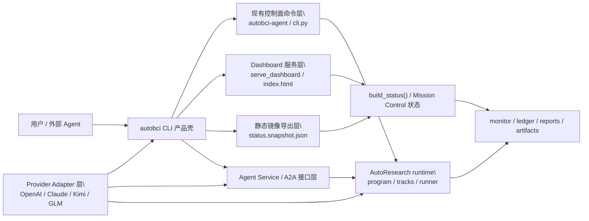
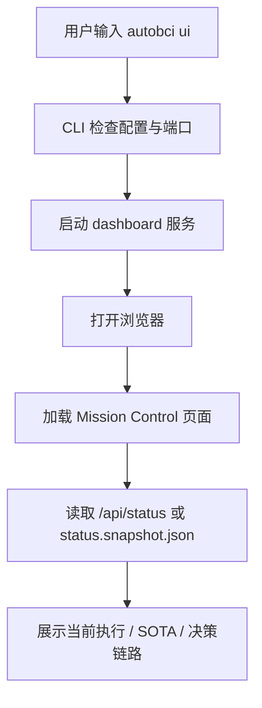
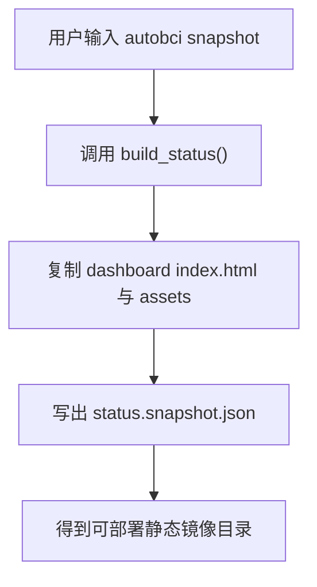
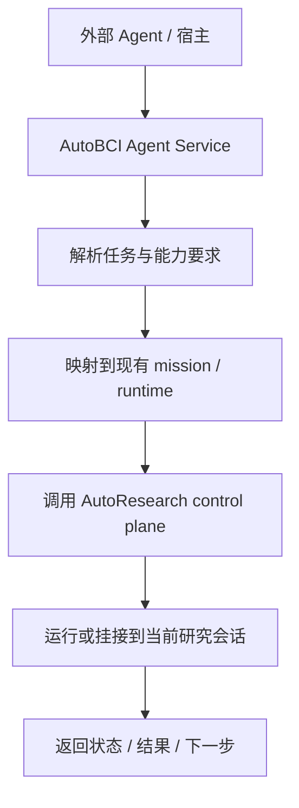

# AutoBCI CLI / Agent 产品化需求文档

日期：2026-04-20  
状态：需求初稿，可进入评审  
适用范围：`/Users/mac/Code/AutoBci`  
目标读者：产品设计、AutoResearch 控制面、CLI / dashboard 开发、跨 Agent 集成开发

## 0. 目录

1. 用自己的话整理需求
2. 当前代码库现状
3. 在任何人看来都无歧义的用户场景和需求描述
4. 产品边界与非目标
5. 方案比较与推荐路线
6. 最终推荐方案
7. 详细技术方案
8. 技术架构图
9. 关键流程图
10. 里程碑与交付物
11. 验收标准
12. 需要你拍板的决策点

## 1. 用自己的话整理需求

你想要的不是“再做一个网页”，而是把现在这套 AutoResearch 研究系统，包装成一个**像真正产品一样可演示、可调用、可接入其他 Agent 框架的 AutoResearch Agent**。

它的第一层体验应该是：

- 用户在终端里输入一个明确的命令，例如 `autobci`
- 它像 OpenAI CLI、Hermes、Claude Code、Codex 这类工具一样，有一个清晰的命令行入口
- 再通过一个子命令，比如 `autobci ui` 或 `autobci dashboard`，直接弹出你现在这套 Mission Control / Dashboard 交互界面

它的第二层体验应该是：

- AutoBCI 不只是“本地一个脚本”，而是一个可以对外声明自己身份的 Agent
- 它可以被别的 Agent、别的 CLI、别的框架调用
- 它后面所用的大模型 / API / token 供应层，不应该写死在某一家格式上，而是要能兼容：
  - OpenAI 风格
  - Anthropic / Claude 风格
  - Kimi / GLM 这一类国内接口风格

它的第三层体验应该是：

- 以后要有一条“像 A2A 一样”的跨 Agent 协作路线
- AutoBCI 可以被别的系统当成一个 AutoResearch Agent 来调用
- 它不只是给人点网页看，而是一个能被其他系统路由、托管、调用、接收任务、返回结果的 Agent 服务

换句话说，这次产品化的重点不是“重写 AutoResearch 内核”，而是：

**把当前已经存在的 CLI、控制面、dashboard、AutoResearch runtime，统一包装成一个像产品、像 Agent、像工具链入口的外壳。**

## 2. 当前代码库现状

这不是从零开始。当前仓库里已经有一套可用但还没有产品化收口的基础设施。

### 2.1 已有 CLI 入口

文件：

- `/Users/mac/Code/AutoBci/src/bci_autoresearch/control_plane/cli.py`
- `/Users/mac/Code/AutoBci/pyproject.toml`

当前已经存在 console entry：

- `autobci-agent`

当前已经支持的子命令包括：

- `status`
- `digest`
- `follow`
- `think`
- `topics`
- `topic-triage`
- `queue`
- `judgment`
- `pause`
- `resume`
- `end`
- `launch`
- `execute`
- `heal`
- `supervise`

这说明：

- 仓库里已经有“控制面 CLI”的雏形
- 现在缺的不是命令行基础能力，而是产品级命名、入口组织、安装体验、对外身份，以及与 dashboard 的统一体验

### 2.2 已有 dashboard 与静态镜像导出

文件：

- `/Users/mac/Code/AutoBci/scripts/serve_dashboard.py`
- `/Users/mac/Code/AutoBci/dashboard/index.html`
- `/Users/mac/Code/AutoBci/scripts/export_dashboard_snapshot.py`

当前已经支持：

- 本地 live dashboard
- `status.snapshot.json` 静态镜像导出
- dashboard 作为本地 Mission Control 的唯一页面源

这说明：

- 现在已经具备“本地交互 UI + 静态镜像”的能力
- 缺的是把这个 UI 正式挂到一个产品级 CLI 入口之下

### 2.3 已有一键操作台原型

文件：

- `/Users/mac/Code/AutoBci/scripts/open_autoresearch_console.sh`

当前脚本已经做了这些事：

- 打开 Hermes TUI
- 打开 AutoBCI follow 视图
- tail 训练日志
- 需要时自动打开 dashboard

这说明：

- “一条命令拉起研究操作台”这个方向已经被验证过
- 现在缺的是把这套体验从 shell 原型，升级成正式 CLI 产品接口

### 2.4 已有 AutoResearch 执行内核

文件：

- `/Users/mac/Code/AutoBci/tools/autoresearch/README.md`
- `/Users/mac/Code/AutoBci/tools/autoresearch/src/launch_campaign.ts`
- `/Users/mac/Code/AutoBci/tools/autoresearch/src/run_campaign.ts`
- `/Users/mac/Code/AutoBci/tools/autoresearch/src/runtime_campaign.ts`

当前已经有：

- contract 驱动的 research program
- track manifest
- smoke / formal 执行
- 回滚保护
- status 写回
- ledger 持久化

这说明：

- 现在的主问题不在“能不能自动研究”
- 而在“如何把它以产品和 Agent 的方式暴露出来”

### 2.5 当前没有现成的能力

当前仓库内**没有**成熟实现的内容：

- 原生 A2A 协议接入层
- 统一 provider adapter 层
- OpenAI / Claude / Kimi / GLM 多家消息格式兼容层
- “在 Claude Code / Codex 内直接 `/AutoBCI` 调起”的宿主适配层

所以这些必须在需求文档里明确为**新增建设项**，而不是假设仓库里已经有。

## 3. 在任何人看来都无歧义的用户场景和需求描述

### 3.1 场景 A：本地终端演示

用户是研究负责人、合作者、评审老师或投资人。

他们在终端里输入：

```bash
autobci
```

或：

```bash
autobci ui
```

系统应当：

1. 启动本地 AutoBCI 控制面
2. 自动打开 dashboard 页面
3. 显示当前 Mission / Campaign / Active Track / SOTA / 决策链路
4. 如果本地已有运行中的研究，会展示当前状态
5. 如果当前只想演示，也能打开只读快照模式

这里的关键不是“弹出网页”本身，而是：

**用户的认知应该是“我在启动一个产品”，而不是“我在手工运行一个 Python 脚本”。**

### 3.2 场景 B：本地 CLI 操作研究系统

用户希望继续用命令行操作 AutoResearch，而不是只看 dashboard。

例如：

```bash
autobci status
autobci think
autobci execute "继续探索纯脑电时序方向"
autobci follow
```

要求：

- CLI 是 AutoBCI 的主入口
- 命令体系必须统一，不再让 `autobci-agent` 成为唯一对外品牌名
- 现有控制面命令能力需要保留

### 3.3 场景 C：作为其他 Agent 的可调用目标

用户在 Claude Code、Codex、Hermes、Studio 或别的 Agent 系统里，希望把 AutoBCI 当成一个“专门做 AutoResearch 的 Agent”来调。

这时对方系统需要知道：

- 这个 Agent 是谁
- 它能做什么
- 它接收什么输入
- 它如何返回状态和结果

要求：

- AutoBCI 应有清晰的 Agent 身份声明
- 要能支持“外部系统把任务交给 AutoBCI”
- 支持把任务带入同一个活着的研究 session，而不是每次都复制出一个假的新实例

### 3.4 场景 D：多家模型 / token / provider 接入

用户希望：

- 不被单一一家大模型 API 绑定
- 能按不同环境切到不同 provider
- 支持 OpenAI、Claude、Kimi、GLM 这类接口风格

要求：

- 上层产品命令不因为 provider 改变而变化
- provider 差异封装在 adapter 层
- 对用户暴露的是统一配置和统一能力声明

### 3.5 场景 E：外部静态展示

用户需要：

- 在本地跑 dashboard
- 导出一份只读镜像给网页端演示

要求：

- 网页端不是重新手写另一套首页
- 而是本地 dashboard 的静态镜像
- 保证 live 视图和 snapshot 视图同构

## 4. 产品边界与非目标

### 4.1 本次要做的事

- 把 AutoBCI 产品化成一个正式 CLI 入口
- 把 dashboard 正式挂到这个 CLI 之下
- 建立 provider adapter 层的需求边界
- 建立 AutoBCI 作为外部 Agent 的协议边界
- 建立本地 live / snapshot / 公网镜像的一致性方案

### 4.2 本次不做的事

本次明确不做：

- 重写 AutoResearch runner
- 重做实验 contract、track、smoke/formal 机制
- 重写 dashboard 的业务语义
- 一上来就做完整远程多租户 SaaS
- 一上来就做完整终端 TUI 替代浏览器 dashboard
- 一上来就做所有宿主 CLI 的原生命令注入

### 4.3 本次不默认承诺的能力

本次不默认承诺：

- “Claude Code 里 `/AutoBCI`”一定能原生实现  
  这取决于宿主是否允许自定义 slash command 扩展
- “A2A”第一阶段就做到跨一切框架真实互联  
  第一阶段更现实的是先定义协议边界与服务接口

## 5. 方案比较与推荐路线

### 方案 A：CLI 启动器方案

做法：

- 保留现有 `autobci-agent`
- 新增一个更友好的外层命令，例如 `autobci`
- `autobci ui` 启动 dashboard
- `autobci status` 等转发到现有控制面

优点：

- 改动最小
- 风险最低
- 最快出可演示版本

缺点：

- A2A、provider 适配、Agent 身份声明都还只是附加层
- 产品感有了，但 Agent 化不彻底

### 方案 B：CLI + Agent Shell 方案

做法：

- 把 `autobci` 做成正式主入口
- 现有 `autobci-agent` 退成兼容别名
- CLI、dashboard、snapshot、provider、agent card 统一收口到一个产品壳层

优点：

- 既能兼顾眼前演示
- 又给后面的 A2A 与多 provider 留足结构
- 是最稳的中期方案

缺点：

- 需要明确模块边界
- 需求文档和实施计划必须更细

### 方案 C：A2A 优先方案

做法：

- 先把 AutoBCI 做成对外协议服务
- CLI 只是协议客户端
- dashboard 只是附加观察窗口

优点：

- 从未来视角最完整
- 最像“真正的 Agent 节点”

缺点：

- 当前仓库基础并不支持第一阶段直接这么落
- 风险高
- 演示和产品落地节奏都会被拖慢

### 推荐路线

推荐采用 **方案 B：CLI + Agent Shell 方案**。

原因：

- 它最符合你现在的真实目标：既要像 CLI 产品，又要保留后面做 A2A 的路线
- 它和当前仓库基础最匹配
- 它不会为了“像 Agent”而把当前已经可用的 dashboard / control-plane / runtime 全推翻

## 6. 最终推荐方案

### 6.1 产品命名与入口

正式对外命令统一为：

```bash
autobci
```

现有：

```bash
autobci-agent
```

保留为兼容入口，但不再作为主要品牌名。

### 6.2 一级命令结构

建议一级命令如下：

```bash
autobci ui
autobci status
autobci follow
autobci think
autobci execute
autobci launch
autobci supervise
autobci snapshot
autobci agent
autobci serve
```

职责如下：

- `autobci ui`
  - 启动 dashboard，并自动打开浏览器
- `autobci status`
  - 查看当前状态
- `autobci follow`
  - 持续跟随当前状态
- `autobci think`
  - 触发思考 / 规划
- `autobci execute`
  - 执行一项任务
- `autobci launch`
  - 发起新 campaign
- `autobci supervise`
  - 进入监督模式
- `autobci snapshot`
  - 导出静态 dashboard 镜像
- `autobci agent`
  - 启动 Agent 服务或输出 agent card / agent manifest
- `autobci serve`
  - 启动协议服务层或本地 API 层

### 6.3 Dashboard 定位

Dashboard 不是产品本体，但它是产品最重要的交互界面。

用户认知应该是：

- 我启动的是 `autobci`
- 其中一个子命令把我带到 Mission Control

而不是：

- 我单独运行一个 `serve_dashboard.py`
- 然后自己记住一个端口

### 6.4 Agent 定位

AutoBCI 在产品层面的身份定义为：

**一个专门做 AutoResearch 的研究 Agent。**

它的职责不是“通用聊天”，而是：

- 接收研究任务
- 调度 AutoResearch program / track / runner
- 汇报当前状态、结果、证据、决策链路

## 7. 详细技术方案

## 7.1 模块拆分

推荐新增以下模块边界：

### A. 产品壳层

建议目录：

```text
src/bci_autoresearch/product_shell/
```

职责：

- 对外命令入口
- 统一 CLI 体验
- 管理 live / snapshot / serve / agent 子命令
- 负责“像产品”的启动体验

### B. Dashboard 服务层

建议目录：

```text
src/bci_autoresearch/dashboard/
```

职责：

- 把当前 `scripts/serve_dashboard.py` 中与 HTTP 服务相关的逻辑抽成可 import 模块
- CLI 可以直接调用
- 仍保留原脚本作为兼容入口

### C. Snapshot 导出层

建议目录：

```text
src/bci_autoresearch/dashboard_snapshot/
```

职责：

- 导出静态镜像
- 管理 `index.html + assets + status.snapshot.json`
- 保证镜像与 live 页面同构

### D. Provider Adapter 层

建议目录：

```text
src/bci_autoresearch/providers/
```

职责：

- 封装不同模型提供方的配置与消息格式差异
- 统一上层调用接口

注意：

第一阶段不要求把整个 AutoResearch runner 的所有底层都抽象到 provider 层，第一阶段重点是：

- 身份统一
- 配置统一
- 能声明自己支持哪些 provider

### E. Agent Service / A2A 层

建议目录：

```text
src/bci_autoresearch/agent_service/
```

职责：

- 输出 agent card / service manifest
- 作为外部系统接入入口
- 提供任务提交、状态查询、结果读取等协议能力

注意：

这层应明确区分：

- “本地控制面”
- “对外 Agent 服务”

不能把 dashboard 直接当 A2A 接口。

## 7.2 CLI 方案细化

### 用户入口

安装后：

```bash
pip install -e .
autobci ui
```

系统行为：

1. 检查 dashboard 服务是否已运行
2. 若未运行，自动启动
3. 选择端口（默认固定一个产品端口）
4. 自动打开浏览器
5. 输出简短终端信息：

```text
AutoBCI dashboard started at http://127.0.0.1:4321
Press Ctrl+C to stop.
```

### 兼容策略

保留：

```bash
autobci-agent
```

但其行为可以逐步转成：

- 提示用户未来使用 `autobci`
- 或作为 `autobci legacy-*` 的兼容别名

## 7.3 Dashboard 方案细化

### live 模式

继续使用当前 `build_status()` 与 `/api/status` 机制。

### snapshot 模式

使用：

- `status.snapshot.json`

规则：

- 页面结构与 live 完全一致
- 只隐藏交互控件
- 不出现另一套网页专用语义

### 目标

做到：

- 本地 live 看的是同一套页面
- 导出的公网页只是同页面的静态镜像

## 7.4 Provider 兼容方案细化

### 第一阶段定义

“支持 OpenAI / Claude / Kimi / GLM 风格”在第一阶段应明确为：

1. 统一配置项
2. 统一 provider 选择方式
3. 统一消息与响应抽象
4. 统一错误与能力声明

不默认承诺：

- 每家 provider 都等价支持工具调用
- 每家 provider 都等价支持长上下文和 session 语义

### 抽象接口建议

```text
ProviderAdapter
├── build_request()
├── parse_response()
├── normalize_usage()
├── supports_tools()
├── supports_streaming()
└── supports_session_resume()
```

这样上层可以明确知道：

- 哪些 provider 只适合“模型后端”
- 哪些 provider 才适合“活着的 Agent session”

## 7.5 A2A / Agent Service 方案细化

### 第一阶段目标

先做：

- AutoBCI 的 agent identity
- 可查询能力说明
- 任务提交入口
- 任务状态查询入口
- 当前 session / mission 的状态返回

### 第一阶段不强行做的事

不要求第一阶段就实现：

- 真正完整跨框架多轮实时 Agent 对话
- Claude Code / Codex 内原生 slash command 注入
- 所有协议宿主的双向 tool use

### 第一阶段最重要的要求

若外部 Agent 通过协议把任务提交给 AutoBCI，必须优先进入：

- 现有 mission
- 或现有 runtime 可识别的上下文

而不是每次都伪造一个新的脱离上下文的临时进程。

## 7.6 Slash Command 诉求如何落地

你提到的：

- 在 Claude Code / Codex 里 `/AutoBCI`

这个产品目标非常合理，但技术上要拆开。

它实际有三种实现等级：

### 等级 1：文档级命令别名

在宿主环境里约定一条 alias / wrapper，让用户执行：

```bash
autobci ui
```

这是最容易落地的。

### 等级 2：宿主插件 / skill / slash adapter

在允许扩展的宿主里，做一个命令桥：

- `/autobci` -> 调本地 `autobci`

### 等级 3：协议级 Agent 对接

宿主并不直接执行 shell，而是通过 Agent service 把请求发给 AutoBCI。

本需求文档建议：

- 第一阶段做到等级 1
- 第二阶段做到等级 2
- 第三阶段做到等级 3

## 8. 技术架构图



## 9. 关键流程图

### 9.1 本地终端演示流程



### 9.2 静态镜像导出流程



### 9.3 外部 Agent 接入流程



## 10. 里程碑与交付物

### M1：CLI 产品壳收口

交付：

- `autobci` 正式主入口
- `autobci ui`
- `autobci snapshot`
- `autobci-agent` 兼容入口

### M2：Dashboard 与镜像统一

交付：

- live / snapshot 完全同构
- 本地 dashboard 作为唯一页面源
- 公网页面只吃镜像产物

### M3：Provider Adapter 第一版

交付：

- provider 抽象层目录
- OpenAI / Claude / Kimi / GLM 配置和能力声明
- 统一 provider 选择机制

### M4：Agent Service 第一版

交付：

- AutoBCI agent identity
- service manifest / agent card
- 任务提交 / 状态读取 API

### M5：宿主命令桥 / slash adapter

交付：

- 在支持扩展的宿主里完成 `/autobci` 命令桥
- 不支持原生命令注入的宿主提供 wrapper 方案

## 11. 验收标准

### 11.1 CLI 产品入口

- 用户安装后可以直接执行：

```bash
autobci ui
```

- 不需要知道内部脚本名

### 11.2 Dashboard 产品体验

- Dashboard 由 CLI 拉起
- Dashboard 不依赖手工记端口
- Dashboard 与 snapshot 使用同一页面源

### 11.3 Provider 抽象

- 用户能明确配置 provider
- 上层命令不因 provider 改变而变化
- 能力差异有清晰声明

### 11.4 Agent 身份

- AutoBCI 能明确对外声明自己是一个 AutoResearch Agent
- 外部系统能知道它能做什么、不能做什么

### 11.5 A2A / 服务接口

- 至少能提交任务并读取状态
- 至少能接入同一研究上下文，而不是每次起孤立进程

## 12. 需要你拍板的决策点

下面这些点会影响实施方案，建议你确认：

### 决策 1：最终对外品牌命令

推荐：

- `autobci`

备选：

- `autobci-agent`
- `autobci-cli`

我的建议：  
直接拍板为 `autobci`，最像产品，最短，最好演示。

### 决策 2：第一阶段 UI 形态

可选：

1. 浏览器 dashboard，由 CLI 拉起  
2. 终端 TUI  
3. 两者都做

我的建议：  
第一阶段只做 **浏览器 dashboard + CLI 启动器**。  
终端 TUI 以后再说，不然你会维护两套交互面。

### 决策 3：`/AutoBCI` 的第一阶段落点

可选：

1. 先做 shell alias / wrapper
2. 先做宿主插件桥
3. 先做协议级 Agent service

我的建议：  
先做 **shell wrapper + agent service 设计预留**，不要第一阶段就赌宿主原生命令注入。

### 决策 4：provider 抽象的第一阶段深度

可选：

1. 只统一配置与请求格式
2. 统一到 tool use / session / streaming 能力层

我的建议：  
第一阶段先做到 **统一配置 + 请求响应抽象 + 能力声明**。  
不要第一阶段就承诺所有 provider 的工具调用完全等价。

### 决策 5：A2A 第一阶段目标

可选：

1. 只做 agent identity + 任务提交 / 状态查询
2. 直接做多轮对等聊天

我的建议：  
第一阶段先做 **identity + task ingress + status egress**。  
“活人感很强的同 session 对话”作为第二阶段目标。

