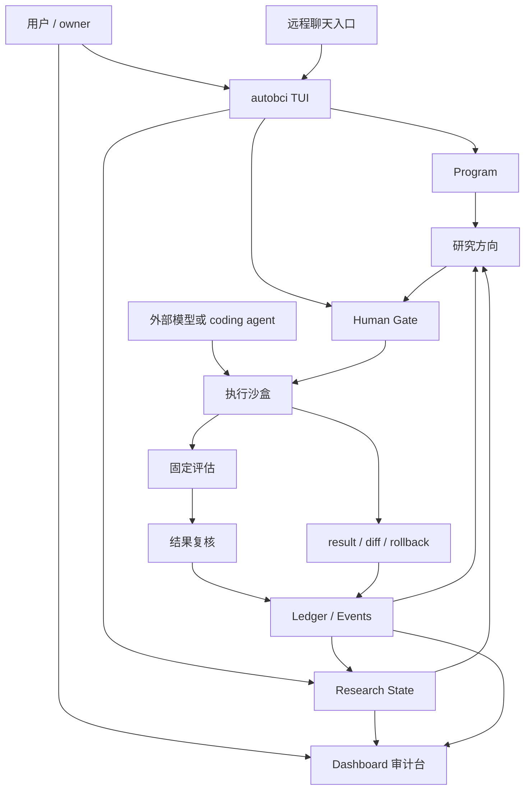

# AutoBCI 架构总览

## 一句话架构

AutoBCI 是本地科研闭环 APP / harness。主线不是一群虚拟 Agent 互相交接，而是一套单主控研究循环：

```text
Program + State + Ledger + Human Gate
        ↓
研究方向
        ↓
执行沙盒
        ↓
固定评估
        ↓
结果复核
        ↓
ledger / dashboard / artifact
```

外部模型、Codex、Claude Code、Pi、MiMo、MiniMax、OpenAI-compatible provider 都是可替换能力。AutoBCI 自己掌握研究契约、状态、边界、固定评估、回滚和审计记录。

## 分层

### 1. 用户入口

- `autobci` TUI：主入口，直接描述研究任务、确认 Program、推进研究闭环。
- Dashboard：研究闭环审计台，只做观察、复盘和任务切换。
- `autobci-agent`：自动化和兼容 CLI，不作为产品品牌主语。
- remote gateway：让手机或外部聊天入口接入当前本地 session。

### 2. 科研状态真源

- Program：当前研究任务、边界、成功指标和禁止动作。
- State：当前任务、当前方向、运行状态和历史选择。
- Ledger：每一步做了什么、为什么做、结果如何、是否保留。
- Human Gate：大步骤和高风险工具调用的确认点。
- Events：TUI 和 Dashboard 共同读取的审计事件流。

### 3. 研究闭环

- 研究方向：根据 Program、ledger、结果和证据生成下一批方向。
- 执行沙盒：运行已有 runner，或在受限 worktree 里让外部 coding agent 修改允许文件。
- 固定评估：用同一套 evaluator 评估，避免把测试集事后最高分包装成提升。
- 结果复核：检查规则、风险、反证、是否晋级、是否回滚。
- 研究记录：把证据、命令、结果、diff、判断链写入本地 artifact。

### 4. 外部能力适配

- 模型运行时：Pi / OpenAI-compatible provider，用于计划、对话和后续可选判断。
- 外部 coding agent：Codex CLI、Claude Code 等，只在执行沙盒内做受限代码改动。
- 本地脚本：固定评估器、数据审计、Dashboard API 和 artifact 生成。

## Mermaid 架构图


