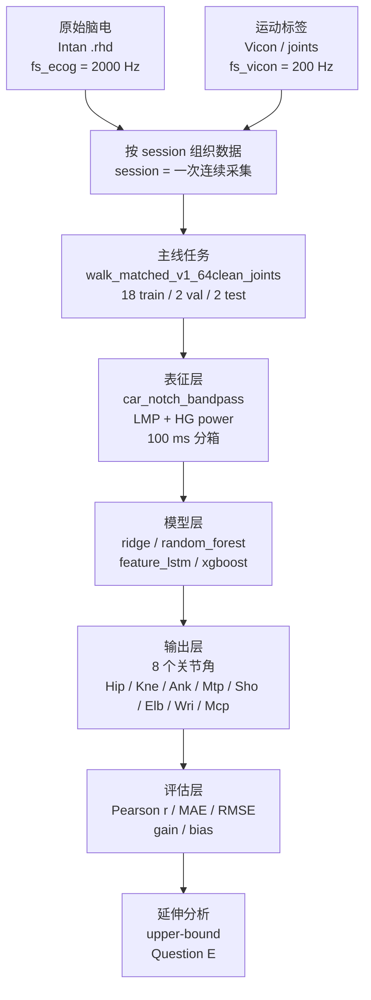
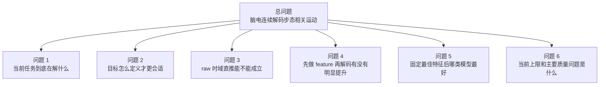

# AutoBci 研究树

这份文稿是当前实验的总入口，目标是让不熟悉算法的人也能快速看懂三件事：

- 现在这个系统到底在解什么问题
- 试过哪些路线，各自效果如何
- 现在最好的结果、当前上限、以及主要教训是什么

## 系统结构图



```text
Intan .rhd (脑电, 2000 Hz) ─┐
                            ├─> session 数据 ─> 主线任务 ─> 表征 ─> 模型 ─> 8 个关节角 ─> 指标
Vicon / joints (运动学, 200 Hz) ─┘

表征: car_notch_bandpass + LMP + HG power + 100 ms 分箱
模型: ridge / random_forest / feature_lstm / xgboost
指标: Pearson r / MAE / RMSE / gain / bias
延伸: upper-bound / Question E
```

### 图里这些词是什么意思

- `Intan .rhd`：Intan 脑电采集系统导出的原始文件格式。
- `Vicon / joints`：Vicon 运动捕捉数据，以及由它算出来的关节角标签。
- `session`：一次连续采集，可以理解成一段完整实验。
- `split`：把所有 session 分成训练、验证、测试三组。
- `car_notch_bandpass`：公共平均参考、陷波、带通这三步预处理放在一起的简称。
- `LMP`：低频运动相关成分，可以粗略理解成“慢变化的脑电趋势”。
- `HG power`：高频功率，通常指 `70–150 Hz` 附近的高频活动强度。
- `ridge`：带正则化的线性回归，简单、稳、好解释。
- `random_forest`：随机森林，用很多棵树一起做预测。
- `feature_lstm`：先做特征，再把特征序列送进 LSTM 学时间关系。
- `xgboost`：梯度提升树模型，通常比单纯的树模型更强。
- `Pearson r`：相关系数，看预测趋势和真实趋势是不是一起变化，越接近 `1` 越好。
- `MAE`：平均绝对误差，单位是角度，越小越好。
- `RMSE`：均方根误差，也是在看误差大小，越小越好。
- `gain`：预测摆幅和真实摆幅的比例，接近 `1` 最理想。
- `bias`：平均偏差，表示预测整体偏高还是偏低。
- `upper-bound`：在更容易的设置下估计系统上限的参考线，这里指同一个 session 内按时间前后切分。

## 研究问题树



```text
总问题: 用脑电连续解码步态相关运动
├─ 问题 1: 当前任务到底在解什么
├─ 问题 2: 目标怎么定义才更合适
├─ 问题 3: raw 时域直推能不能成立
├─ 问题 4: 先做 feature 再解码有没有明显提升
├─ 问题 5: 固定最佳特征后哪类模型最好
└─ 问题 6: 当前上限和主要质量问题是什么
```

## 问题 1：当前任务到底在解什么

这个问题在问：现在这条主线，输入是什么，输出是什么，怎么评估。

为什么重要：如果任务定义不清楚，后面的模型分数就没有统一参照。

### 当前主线定义

| 项目 | 当前设置 | 解释 |
| --- | --- | --- |
| 数据集 | `walk_matched_v1_64clean_joints` | 只保留有效 `64` 通道的正式主线数据集 |
| 目标 | `joints_sheet` | Excel 第二个 sheet 里的 `8` 个关节角 |
| 输出关节 | `Hip, Kne, Ank, Mtp, Sho, Elb, Wri, Mcp` | 右侧下肢加上右侧上肢的 `8` 个角度 |
| split | `18 train / 2 val / 2 test` | 跨 session 切分，不是同一段数据内前后切开 |
| 脑电采样率 | `2000 Hz` | 每秒 `2000` 个采样点 |
| 运动学采样率 | `200 Hz` | 每秒 `200` 帧 |
| 窗长 | `3.0 s` | 每次预测看过去 `3` 秒 |
| 步长 | `400 samples = 200 ms` | 每 `200 ms` 出一个预测 |
| 特征分箱 | `100 ms` | 先把脑电按 `100 ms` 做摘要 |
| 主指标 | `val mean_pearson_r_zero_lag_macro` | 验证集上 `8` 个关节宏平均相关系数 |

### 数据集到底包含哪天、哪几组

- 这套主线数据一共是 `22` 条 session。
- 脑电总时长约 `12352.4` 秒，也就是约 `205.9` 分钟，接近 `3` 小时 `26` 分钟。
- 其中：
  - `2024-07-17` 有 `12` 组：
    - `01, 03, 04, 05, 06, 07, 08, 09, 10, 12, 14, 16`
    - 合计约 `6421.3` 秒，也就是约 `107.0` 分钟
  - `2024-07-19` 有 `10` 组：
    - `01, 02, 03, 04, 05, 06, 07, 08, 09, 10`
    - 合计约 `5931.1` 秒，也就是约 `98.9` 分钟
- `session_id` 的读法：
  - 例如 `walk_20240717_16`
  - `20240717` 是日期
  - `16` 是当天第 `16` 组 walk 记录
- 单条 session 的时长范围：
  - 最短约 `309.6` 秒
  - 最长约 `659.6` 秒

### 主线 split 的具体分组

- `train` 一共 `18` 组：
  - `2024-07-17`：
    - `01, 03, 04, 05, 06, 07, 08, 09, 10, 14`
  - `2024-07-19`：
    - `01, 02, 03, 04, 05, 06, 08, 09`
- `val` 一共 `2` 组：
  - `walk_20240717_12`
  - `walk_20240719_07`
- `test` 一共 `2` 组：
  - `walk_20240717_16`
  - `walk_20240719_10`
- 按总时长看：
  - `train` 约 `10266.8` 秒，也就是约 `171.1` 分钟
  - `val` 约 `990.5` 秒，也就是约 `16.5` 分钟
  - `test` 约 `1095.1` 秒，也就是约 `18.3` 分钟

### 上限线用的是哪几组

- `upper-bound` 不是另一批新数据。
- 它用的还是这 `22` 条 session 里的数据。
- 只是它**只取主线 train 里的那 `18` 条 session**。
- 然后把每一条 session 在时间上再切成：
  - `70% train`
  - `15% val`
  - `15% test`
- 所以 `upper-bound` 更像“同一条录制里的上限参考”，不是新的跨天 split。
- 这一点和论文更接近，因为论文也是单个连续记录内部做前后切开，而不是跨天泛化。

### 当前三层状态

| 角色 | run | 含义 |
| --- | --- | --- |
| `frozen_baseline` | `stageC_ridge` | 长期保留的稳定对照线 |
| `accepted_stable_best` | `stageC_xgboost_256` | 当前最稳定、正式采用的最好结果 |
| `leading_unverified_candidate` | 空 | 现在没有待复验的新冠军 |

### 当前结论

- 当前主线不是在解一个 `3D` 点轨迹，而是在解 `8` 个关节角。
- 这条线最难的地方是 **跨 session 泛化**，不是单一 session 内部的拟合。
- 现在最好的稳定结果已经不在 `0.2` 量级，而是在 `0.37` 左右。

### 关节缩写说明

- `Hip`：髋
- `Kne`：膝
- `Ank`：踝
- `Mtp`：跖趾
- `Sho`：肩
- `Elb`：肘
- `Wri`：腕
- `Mcp`：掌指

## 问题 2：目标怎么定义才更合适

这个问题在问：应该直接预测 marker 的 `XYZ` 轨迹，还是预测关节角。

为什么重要：目标怎么定义，会直接决定任务难度、解释性和稳定性。

### 两条目标路线

| 路线 | 它是什么 | 优点 | 当前问题 |
| --- | --- | --- | --- |
| `XYZ / 投影` | 直接预测 marker 的三维位置或投影 | 更接近论文里 `3D endpoint` 的写法 | 更容易受到跑步机整体平移影响 |
| `joints_sheet` | 预测 `8` 个关节角 | 维度更低，更适合当前跨 session 主线 | 它是派生标签，不是独立真值 |

### 当前证据

- 现有分析支持 `YZ` 平面和 `joints` 最接近。
- 不能把这个结论写成“只有 Y 方向信息量大”。
- 更准确的说法是：当前 `joints` 的几何定义主要依赖 `Y` 和 `Z` 两个方向，`X` 的贡献较小。

### 当前最好的版本

- 当前正式主线继续用 `joints_sheet`。
- `XYZ / 投影` 更适合后面做论文对照用的三方向 benchmark，不替代主线。

### 当前教训

- 目标先定义清楚，比一开始就换更大的模型更重要。
- 当前这批数据里，`joints_sheet` 是更稳的主线目标。

## 问题 3：raw 时域直推能不能成立

这个问题在问：不做特征，直接把原始时域脑电送进模型，当前能不能跑出有用结果。

为什么重要：这条线最直观，但也最容易把噪声、漂移和 session 差异一起吃进去。

### 做过的路线

| run | model | target | feature | val r | test r | test MAE | test RMSE | 当前判断 |
| --- | --- | --- | --- | ---: | ---: | ---: | ---: | --- |
| `raw128_control` | control | raw marker 轨迹 | raw 时域 | - | 0.0280 | - | - | 只能说明链路能跑 |
| `64clean_raw_lstm` | LSTM | `36` 维 marker `XYZ` | raw 时域 | - | -0.0221 | - | - | 当前不可用 |
| `joints_sheet_baseline_000` | LSTM | `joints_sheet` | raw 时域 | 0.0312 | 0.0417 | 9.7584° | 12.0696° | 接上了目标，但效果很弱 |

### 当前最好的版本

- 这一组里最好的是 `joints_sheet_baseline_000`，但它仍然很弱。

### 当前摸到的上限

- raw 时域直推在当前任务下，没有摸到可作为主线的上限。

### 当前教训

- 当前设置下，raw 路线没有站住。
- 问题不只是模型不够大，更像是输入表示本身不合适。

## 问题 4：先做 feature 再解码有没有明显提升

这个问题在问：先把脑电做成更稳定的特征，再交给简单模型，能不能明显更强。

为什么重要：这是当前真正带来提升的主方向。

### 4.1 简单统计特征

`simple_stats` 的意思是对一个时间窗口做简单摘要，比如 `mean`、`abs_mean`、`rms`。
其中：

- `mean`：平均值
- `abs_mean`：绝对值再求平均
- `rms`：均方根，能反映信号整体能量

| run | model | target | feature | val r | test r | test MAE | test RMSE | 当前判断 |
| --- | --- | --- | --- | ---: | ---: | ---: | ---: | --- |
| `stageA_ridge_absmean_rms` | ridge | `joints_sheet` | `abs_mean + rms` | 0.1574 | 0.0988 | 9.6504° | 12.0839° | 去掉 `mean` 后明显变差 |
| `stageA_ridge_mean_only` | ridge | `joints_sheet` | `mean` | 0.2219 | 0.2296 | 9.3815° | 11.8333° | `mean` 单独已经很强 |
| `joints_sheet_ridge(mean+abs_mean+rms)` | ridge | `joints_sheet` | `mean + abs_mean + rms` | 0.2254 | 0.1828 | 9.4578° | 11.9766° | 旧 accepted best |

当前教训：

- `mean` 很有用，但不能直接把它讲成“纯神经特征”。
- 它更像是任务相关信息和慢变化成分混在一起。

### 4.2 更像神经信号的特征

`car_notch_bandpass` 是一组预处理：

- `CAR`：公共平均参考，用来压掉通道间共同噪声
- `notch`：陷波，用来压掉固定频率干扰
- `bandpass`：带通，只保留感兴趣的频段

在这之后，再提两类特征：

- `LMP`：低频成分，更像慢变化趋势
- `HG power`：高频功率，更像局部高频活动强度

| run | model | target | feature | val r | test r | test MAE | test RMSE | 当前判断 |
| --- | --- | --- | --- | ---: | ---: | ---: | ---: | --- |
| `stageB_ridge_lmp` | ridge | `joints_sheet` | `lmp` | 0.2180 | 0.2197 | 9.4023° | 11.8458° | 低频趋势有用 |
| `stageB_ridge_hg` | ridge | `joints_sheet` | `hg_power` | 0.3153 | 0.1879 | 9.4477° | 11.9321° | 高频信息也有用 |
| `stageB_ridge_lmp_hg` | ridge | `joints_sheet` | `lmp + hg_power` | 0.3180 | 0.2322 | 9.3294° | 11.8382° | 当前 feature-first baseline |
| `stageB_ridge_bandpower_bank` | ridge | `joints_sheet` | `bandpower_bank` | 0.3131 | 0.1687 | 10.5081° | 13.3009° | 这组当前不适合作主线 |

### 当前最好的版本

- 当前最好的 feature 组合是 `lmp + hg_power`。

### 当前摸到的上限

- 只看 feature-first + ridge，这条线把 `test r` 从 `0.1828` 拉到了 `0.2322`。

### 当前教训

- 当前提升首先来自 **表征变化**。
- 不是先靠更深网络才把结果拉起来。

## 问题 5：固定最佳特征后，哪类模型最好

这个问题在问：在同一个最好特征 `lmp + hg_power` 上，换不同模型，谁最合适。

为什么重要：这样比较时，模型之间才是公平的。

### 做过的模型

- `ridge`：线性回归，加一个防止过拟合的约束
- `random_forest`：很多棵树一起投票
- `feature_lstm`：先做特征，再让 LSTM 学时间顺序
- `xgboost`：一棵树接一棵树修正前面的误差

| run | model | target | feature | val r | test r | test MAE | test RMSE | 当前判断 |
| --- | --- | --- | --- | ---: | ---: | ---: | ---: | --- |
| `stageC_ridge` | ridge | `joints_sheet` | `lmp + hg_power` | 0.3180 | 0.2322 | 9.3294° | 11.8382° | `frozen_baseline` |
| `stageC_random_forest` | random_forest | `joints_sheet` | `lmp + hg_power` | 0.3139 | 0.2604 | 9.0275° | 11.5226° | 比 ridge 稍强，但不够稳定领先 |
| `stageC_feature_lstm_seed_summary` | feature_lstm | `joints_sheet` | `lmp + hg_power` | 0.4227 | 0.3483 | 8.9200° | 11.4741° | 已复验完成的上一档稳定结果 |
| `stageC_xgboost_256_seed_summary` | xgboost | `joints_sheet` | `lmp + hg_power` | 0.4329 | 0.3712 | 8.5563° | 10.9990° | 当前 `accepted_stable_best` |

### 当前最好的版本

- 当前 stable best 是 `stageC_xgboost_256`。

### 当前摸到的上限

- 在当前主线任务下，`XGBoost` 的稳定结果已经到 `test r = 0.3712`。

### 当前教训

- `XGBoost` 现在是主指标最好的路线。
- 但这不代表它在所有关节上都最自然，压幅问题还要继续单独看。

## 问题 6：当前上限和主要质量问题是什么

这个问题在问：如果把任务变容易一些，系统能到哪里；当前主线又主要卡在哪。

为什么重要：这样才能分清“信号本身不够”还是“当前任务太难”。

### 6.1 upper-bound

`upper-bound` 的意思是：不用跨 session，只在同一个 session 内按时间前后切分训练和测试。
这条线更容易，所以只能当参考，不写回主线 best。

| run | model | val r | test r | 当前判断 |
| --- | --- | ---: | ---: | --- |
| `upper_bound ridge` | ridge | 0.2621 | 0.2953 | 同 session 条件下，ridge 也会变强 |
| `upper_bound feature-LSTM` | feature_lstm | 0.4394 | 0.4745 | 当前最高的单 family 上限之一 |
| `upper_bound XGBoost` | xgboost | 0.4614 | 0.4723 | 和 upper-bound feature-LSTM 很接近 |

当前结论：

- 当前主线不是没有信号。
- 同 session 上限已经接近 `0.47`，主要难点还是跨 session 泛化。

### 6.2 当前主要质量问题：压幅

`Question E` 现在在看三个哨兵关节：

- `Kne`：膝
- `Wri`：腕
- `Mcp`：掌指

之所以盯它们，是因为当前模型常见的问题不是完全跟不上，而是**会跟趋势，但摆幅偏小**。

| model | joint | r | MAE | RMSE | gain | bias |
| --- | --- | ---: | ---: | ---: | ---: | ---: |
| ridge | Kne | 0.2833 | 13.1728 | 16.6542 | 0.4637 | -4.9245 |
| ridge | Wri | 0.3014 | 13.3483 | 17.5100 | 0.5035 | -0.8036 |
| ridge | Mcp | 0.1288 | 10.2329 | 13.4986 | 0.3087 | 4.6293 |
| feature-LSTM | Kne | 0.4256 | 11.8280 | 15.3023 | 0.5940 | -3.5729 |
| feature-LSTM | Wri | 0.4052 | 12.8678 | 16.9831 | 0.6755 | -3.0826 |
| feature-LSTM | Mcp | 0.2470 | 9.8185 | 13.2302 | 0.3100 | 5.0948 |
| XGBoost | Kne | 0.4246 | 12.0585 | 15.2640 | 0.4196 | -3.9368 |
| XGBoost | Wri | 0.4533 | 11.9770 | 16.0261 | 0.4671 | -0.9230 |
| XGBoost | Mcp | 0.2073 | 9.7543 | 13.2145 | 0.3698 | 4.3797 |

### 当前最好的版本

- 主指标最好的是 `XGBoost`。
- `Kne / Wri` 的 `gain` 上，`feature-LSTM` 更接近真实摆幅。
- `Mcp` 上，`XGBoost` 相对更好一些。

### 当前摸到的上限

- 当前问题不是某一个关节坏掉，而是压幅在多个关节上普遍存在。

### 当前教训

- 现在最主要的问题不是“模型完全不会动”。
- 更像是：模型学到了趋势，但峰谷恢复还不够。

## 当前研究结论

到现在为止，可以把整棵研究树压成 5 句话：

1. 当前主线最稳的目标还是 `joints_sheet`，不是直接的 `XYZ` 轨迹。
2. raw 时域直推在当前任务下没有站住。
3. 当前最重要的提升来自 feature-first，尤其是 `lmp + hg_power`。
4. 固定这组特征后，当前 stable best 是 `XGBoost`。
5. 当前主线最主要的问题不是“完全不会”，而是跨 session 泛化和压幅。

## 和陶虎论文的差别

| 项目 | 陶虎论文 | 当前主线 |
| --- | --- | --- |
| 电极 | `256ch μECoG` | `64` 有效通道 |
| 输入 | `HG PSD` | `lmp + hg_power` |
| 时间粒度 | `100 ms` | `100 ms` |
| 目标 | `3D endpoint` | `8` 个关节角 |
| 切分 | 同段 `7:3` | 跨 session `18/2/2` |
| 评价 | `r_x / r_y / r_z` | `8` 关节宏平均 `r` |
| 数据时长 | 约 `30` 分钟连续记录 | 约 `205.9` 分钟，总共 `22` 条 session |

- 论文的 `0.83–0.90` 不能直接和当前主线做一一对比。
